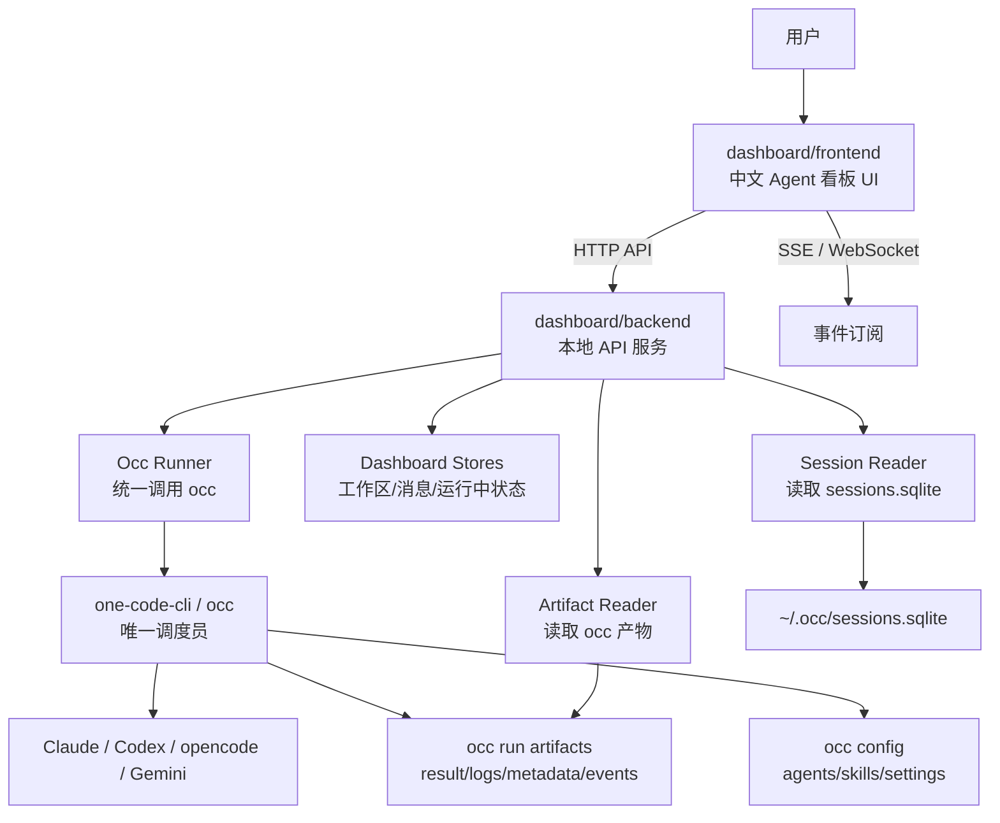
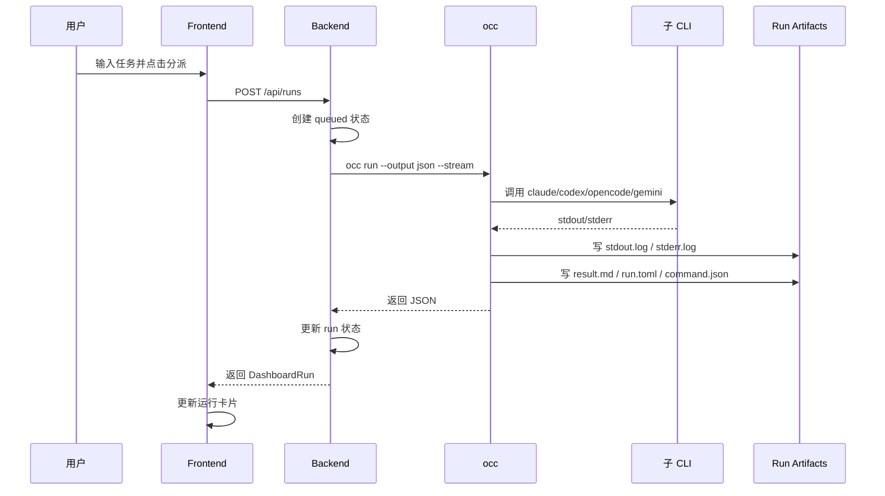
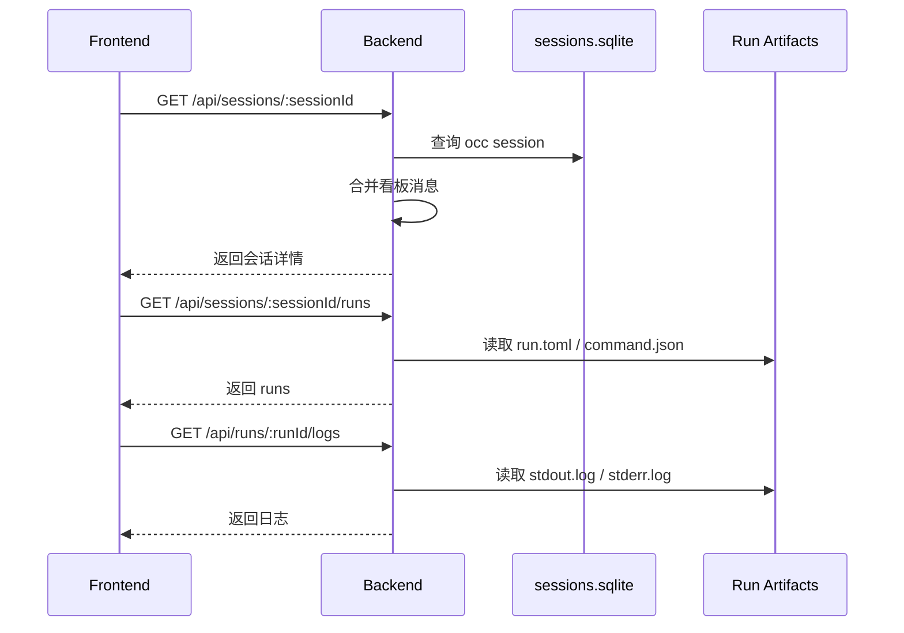
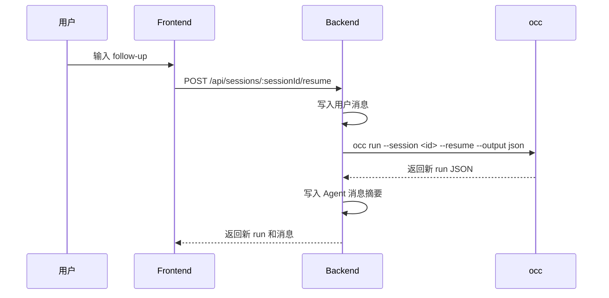
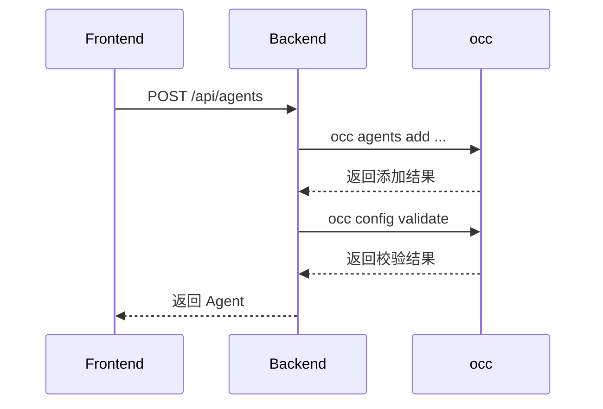
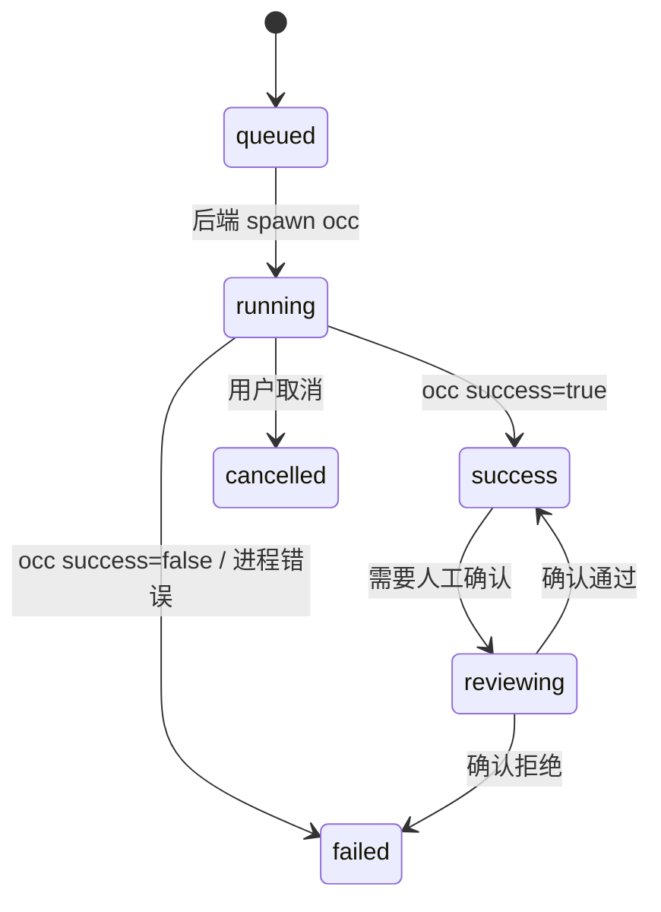

# Agent 看板架构设计

本文描述 `AgentPanels` 上层 Agent 看板的系统架构。看板必须基于 `docs/prototypes` 下的图片原型开发，采用前后端分离架构，并以 `one-code-cli` / `occ` 作为唯一调度员和操作工具。

相关文档：

- `docs/agent-dashboard-development-plan.zh-CN.md`
- `docs/prototypes/01-workspace-focused-dashboard-cn.png`
- `docs/prototypes/02-session-execution-detail-cn.png`
- `docs/prototypes/03-workspace-skills-agents-cn.png`
- `docs/prototypes/04-custom-agent-builder-cn.png`
- `one-code-cli/`

---

## 1. 架构目标

### 1.1 产品目标

Agent 看板要解决的问题：

- 一个界面管理多个工作区。
- 通过主 Agent 分派任务给不同 Agent。
- 打开会话后能看到对话、执行过程、目录结构、日志、产物和运行信息。
- 把 `Agents`、`Skills`、`Agent 开发` 做成一级能力。
- 不重写底层调度能力，而是复用 `one-code-cli`。

### 1.2 技术目标

架构必须满足：

- 前后端分离。
- 前端不能直接访问本机文件、SQLite 或执行命令。
- 后端是唯一能调用 `occ` 的层。
- 所有任务分派、会话恢复、Agent 操作、Skill 操作都必须走 `occ`。
- API 预留未来扩展能力：`occ daemon`、插件、审计、权限、远程执行。
- UI 必须按图片原型开发和验收。

---

## 2. 总体架构



系统分三层：

| 层级 | 模块 | 职责 |
| --- | --- | --- |
| 展示层 | `dashboard/frontend` | 中文 UI、交互、状态展示、图片原型还原 |
| 控制层 | `dashboard/backend` | API、调用 `occ`、读取产物、事件推送、缓存运行状态 |
| 调度层 | `one-code-cli/occ` | 调度 Agent、调用底层 CLI、写运行产物和会话索引 |

---

## 3. 项目边界

### 3.1 `AgentPanels` 上层项目

`AgentPanels` 是产品项目，负责看板本身。

建议目录：

```text
E:\Codes\AgentPanels\
  docs/
    prototypes/
    agent-dashboard-development-plan.zh-CN.md
    agent-dashboard-architecture.zh-CN.md
  dashboard/
    frontend/
    backend/
  one-code-cli/
```

### 3.2 `one-code-cli` 底层项目

`one-code-cli` 是底层调度员，不承载看板 UI。

它负责：

- `occ run`
- `occ run --agents`
- `occ run --session ... --resume`
- `occ agents ...`
- `occ skills ...`
- `occ config ...`
- 写入运行产物和会话记录

看板不能在 `one-code-cli` 内直接混入前端业务。后续如果需要增强 `occ`，应作为底层能力提交到 `one-code-cli`，例如 JSON 输出、结构化事件、`occ daemon`。

---

## 4. 前端架构

### 4.1 前端职责

前端只负责界面和交互：

- 渲染工作区聚焦看板。
- 渲染会话执行详情页。
- 渲染 Agents、Skills、Agent 开发页面。
- 通过 API 创建任务、继续会话、测试 Agent。
- 订阅事件流并更新 UI。
- 展示日志、产物、运行信息。

前端禁止：

- 直接调用 `occ`。
- 使用 `child_process`。
- 直接读取 `~/.occ`。
- 直接读取 workspace 文件系统。
- 直接读写 SQLite。
- 直接调用 Claude、Codex、opencode、Gemini。

### 4.2 页面结构

```text
dashboard/frontend/src/app/
  page.tsx
  sessions/[sessionId]/page.tsx
  agents/page.tsx
  skills/page.tsx
  agent-builder/page.tsx
  settings/page.tsx
```

页面和图片对应关系：

| 页面 | 路径 | 原型 |
| --- | --- | --- |
| 工作区聚焦看板 | `/` | `01-workspace-focused-dashboard-cn.png` |
| 会话执行详情 | `/sessions/:sessionId` | `02-session-execution-detail-cn.png` |
| Agents / Skills 工作区页 | `/agents`, `/skills` | `03-workspace-skills-agents-cn.png` |
| Agent 开发 | `/agent-builder` | `04-custom-agent-builder-cn.png` |

### 4.3 前端模块

```text
components/
  layout/
    AppShell
    TopCommandBar
    LeftNavigation
  workspace/
    WorkspaceSwitcher
    WorkspaceList
    WorkspaceTabs
  runs/
    RunPipeline
    RunColumn
    RunCard
    RunDetailLink
  sessions/
    ConversationPanel
    MessageBubble
    TaskComposer
    ExecutionTimeline
  logs/
    LiveLogViewer
    EventStreamPanel
  artifacts/
    ArtifactPanel
    RunMetadataPanel
  agents/
    AgentList
    AgentDetail
    AgentBuilderForm
  skills/
    SkillList
    SkillDetail
    SkillSelector
```

### 4.4 前端数据访问

前端通过 `api-client` 访问后端：

```text
api-client/
  client.ts
  health.ts
  workspaces.ts
  runs.ts
  sessions.ts
  agents.ts
  skills.ts
  events.ts
```

前端的所有数据请求必须走：

```text
/api/*
```

实时更新走：

```text
/api/events/stream
/api/runs/:runId/stream
```

---

## 5. 后端架构

### 5.1 后端职责

后端是看板的本地控制面：

- 对前端提供 API。
- 定位和调用 `occ`。
- 解析 `occ --output json`。
- 读取 `occ` 运行产物。
- 读取 `~/.occ/sessions.sqlite`。
- 管理看板自己的工作区、消息和运行状态。
- 提供 SSE / WebSocket 事件流。
- 处理路径、编码、进程和错误码。

### 5.2 后端模块

```text
dashboard/backend/src/
  index.ts
  config.ts
  routes/
    health.ts
    workspaces.ts
    runs.ts
    sessions.ts
    agents.ts
    skills.ts
    events.ts
    reserved.ts
  services/
    occ-runner.ts
    occ-artifacts.ts
    workspace-store.ts
    run-store.ts
    session-store.ts
    agent-service.ts
    skill-service.ts
    event-bus.ts
    path-utils.ts
  types/
    api.ts
    occ.ts
    dashboard.ts
```

### 5.3 后端服务职责

| 服务 | 职责 |
| --- | --- |
| `occ-runner` | 统一执行 `occ` 命令，捕获 stdout/stderr，解析 JSON |
| `occ-artifacts` | 根据 run_id 读取 `result.md`、日志、`run.toml`、`command.json` |
| `workspace-store` | 保存和读取看板工作区列表 |
| `run-store` | 保存运行中状态、批次状态、临时状态 |
| `session-store` | 保存看板消息流，读取 `~/.occ/sessions.sqlite` |
| `agent-service` | 包装 `occ agents` 和 `occ config` 能力 |
| `skill-service` | 包装 `occ skills`，扫描已安装 Skills |
| `event-bus` | 向前端推送运行事件、日志事件、工作区事件 |
| `path-utils` | 清洗 Windows `\\?\` 路径，统一展示路径 |

---

## 6. `occ` 集成边界

### 6.1 允许调用的 `occ` 命令

后端操作必须通过这些命令：

```powershell
occ --version
occ doctor
occ config validate
occ config show --raw
occ run ...
occ run --agents ...
occ run --session <id> --resume ...
occ agents list
occ agents show <name>
occ agents test <name>
occ agents add ...
occ skills list
occ skills show <name>
occ skills install
occ skills doctor
occ sessions list
occ sessions show <session_id>
occ runs list
occ runs show <run_id>
occ runs open <run_id> --print
```

### 6.2 禁止绕过 `occ`

后端不能：

- 直接 spawn `claude`。
- 直接 spawn `codex`。
- 直接 spawn `opencode`。
- 直接 spawn `gemini`。
- 自己拼底层 CLI 的 session 参数。
- 自己实现 Agent 调度策略替代 `occ`。

### 6.3 可直接读取的 `occ` 数据

后端可以读取这些由 `occ` 管理的数据：

```text
<doc_root>/index.jsonl
<doc_root>/runs/<run_id>/prompt.md
<doc_root>/runs/<run_id>/result.md
<doc_root>/runs/<run_id>/stdout.log
<doc_root>/runs/<run_id>/stderr.log
<doc_root>/runs/<run_id>/events.jsonl
<doc_root>/runs/<run_id>/command.json
<doc_root>/runs/<run_id>/run.toml
~/.occ/sessions.sqlite
~/.occ/config.toml
~/.agents/skills
```

读取这些文件只用于展示和聚合。任何执行动作仍必须走 `occ` 命令。

---

## 7. 核心数据流

### 7.1 创建任务



### 7.2 打开会话详情



### 7.3 继续会话



### 7.4 Agent 创建



---

## 8. 数据模型

### 8.1 Workspace

```ts
type Workspace = {
  id: string;
  name: string;
  path: string;
  docRoot?: string;
  active: boolean;
  lastOpenedAt?: string;
  createdAt: string;
  updatedAt: string;
  reserved?: {
    remoteUrl?: string;
    branch?: string;
    tags?: string[];
  };
};
```

### 8.2 DashboardRun

```ts
type DashboardRun = {
  runId: string;
  sessionId: string;
  workspaceId: string;
  workspacePath: string;
  title: string;
  prompt: string;
  agent: string;
  cli: string;
  model?: string;
  effort?: string;
  status: "queued" | "running" | "reviewing" | "success" | "failed" | "cancelled";
  resultPath?: string;
  metadataPath?: string;
  stdoutPath?: string;
  stderrPath?: string;
  commandPath?: string;
  startedAt?: string;
  finishedAt?: string;
  exitCode?: number;
  occ: {
    rawResponse?: unknown;
    command?: string[];
    docRoot?: string;
  };
  reserved?: {
    reviewRequired?: boolean;
    parentBatchId?: string;
    agentGraphNodeId?: string;
  };
};
```

### 8.3 DashboardSession

```ts
type DashboardSession = {
  sessionId: string;
  title: string;
  workspaceId: string;
  workspacePath: string;
  agent: string;
  cli: string;
  latestRunId?: string;
  updatedAt: string;
  messages: DashboardMessage[];
  reserved?: {
    parentSessionId?: string;
    sharedContextId?: string;
    reviewState?: "none" | "pending" | "approved" | "rejected";
  };
};
```

### 8.4 DashboardMessage

```ts
type DashboardMessage = {
  id: string;
  sessionId: string;
  role: "user" | "main-agent" | "agent" | "system";
  agent?: string;
  runId?: string;
  content: string;
  createdAt: string;
  reserved?: {
    attachments?: string[];
    toolCalls?: unknown[];
    reviewState?: string;
  };
};
```

### 8.5 DashboardAgent

```ts
type DashboardAgent = {
  name: string;
  aliases: string[];
  cli: "claude" | "codex" | "opencode" | "gemini" | string;
  model?: string;
  effort?: string;
  source: "builtin" | "config";
  envMode?: "inherit" | "strict";
  status?: "unknown" | "ready" | "missing" | "error";
  reserved?: {
    icon?: string;
    color?: string;
    capabilities?: string[];
    defaultSkills?: string[];
    routingWeight?: number;
  };
};
```

### 8.6 DashboardSkill

```ts
type DashboardSkill = {
  name: string;
  title?: string;
  description: string;
  source: "builtin" | "installed" | "project";
  enabled: boolean;
  path?: string;
  reserved?: {
    compatibleAgents?: string[];
    requiredTools?: string[];
    version?: string;
    marketplaceId?: string;
  };
};
```

---

## 9. API 架构

统一响应格式：

```ts
type ApiResponse<T> = {
  ok: boolean;
  data?: T;
  error?: {
    code: string;
    message: string;
    details?: unknown;
  };
};
```

### 9.1 核心 API

| API | 说明 | 后端实现 |
| --- | --- | --- |
| `GET /api/health` | 健康检查 | `occ --version`、`occ doctor` |
| `GET /api/workspaces` | 工作区列表 | 看板 store |
| `POST /api/workspaces` | 添加工作区 | 校验路径，保存 store |
| `GET /api/runs` | 运行列表 | 读取 index 和 run store |
| `POST /api/runs` | 创建运行 | `occ run` |
| `GET /api/runs/:runId` | 运行详情 | 读取 `run.toml`、`command.json` |
| `GET /api/runs/:runId/result` | 运行结果 | 读取 `result.md` |
| `GET /api/runs/:runId/logs` | 日志 | 读取 `stdout.log`、`stderr.log` |
| `GET /api/sessions` | 会话列表 | 读取 `sessions.sqlite` |
| `POST /api/sessions/:id/resume` | 继续会话 | `occ run --session ... --resume` |
| `GET /api/agents` | Agent 列表 | `occ agents list` |
| `POST /api/agents` | 新增 Agent | `occ agents add` |
| `POST /api/agents/:name/test` | 测试 Agent | `occ agents test` |
| `GET /api/skills` | Skill 列表 | `occ skills list` |
| `POST /api/skills/install` | 安装 Skills | `occ skills install` |

### 9.2 预留 API

这些接口第一版可以返回 `501 not_implemented`，但路由和响应结构要保留：

| API | 预留目的 |
| --- | --- |
| `POST /api/main-agent/plan` | 主 Agent 规划 |
| `POST /api/main-agent/route` | 主 Agent 路由 |
| `GET /api/main-agent/queue` | 调度队列 |
| `POST /api/runs/:runId/cancel` | 取消运行 |
| `GET /api/events/stream` | 全局事件流 |
| `GET /api/runs/:runId/stream` | 单次运行事件流 |
| `POST /api/plugins/install` | 插件安装 |
| `GET /api/plugins` | 插件列表 |
| `GET /api/audit/events` | 审计事件 |
| `POST /api/occ/daemon/connect` | 未来连接 `occ daemon` |

---

## 10. 存储架构

### 10.1 `occ` 存储

`occ` 仍然拥有运行记录和会话索引：

```text
~/.occ/
  config.toml
  sessions.sqlite
  runs/
  index.jsonl
```

项目内 doc root 可以是：

```text
<workspace>/.occ/
```

### 10.2 看板存储

看板需要自己的轻量存储，用于保存 `occ` 没有覆盖的产品数据：

```text
~/.agent-panels/
  dashboard.sqlite
  settings.json
```

建议表：

- `workspaces`
- `dashboard_runs`
- `dashboard_sessions`
- `dashboard_messages`
- `run_state_cache`
- `agent_ui_preferences`
- `skill_bindings`

看板存储不能替代 `occ` 存储。它只补充 UI 和产品层数据。

---

## 11. 事件架构

### 11.1 第一版事件来源

第一版事件来自：

- 后端创建任务时产生 `run.created`。
- 后端 spawn `occ` 时产生 `run.started`。
- 后端 tail `stdout.log` 时产生 `run.stdout`。
- 后端 tail `stderr.log` 时产生 `run.stderr`。
- `occ` 返回 JSON 时产生 `run.finished`。
- 工作区切换时产生 `workspace.changed`。

### 11.2 事件类型

```ts
type DashboardEvent =
  | { type: "run.created"; runId: string; at: string }
  | { type: "run.started"; runId: string; at: string }
  | { type: "run.stdout"; runId: string; chunk: string; at: string }
  | { type: "run.stderr"; runId: string; chunk: string; at: string }
  | { type: "run.finished"; runId: string; success: boolean; at: string }
  | { type: "workspace.changed"; workspaceId: string; at: string };
```

### 11.3 后续演进

当 `occ` 增强结构化事件后，后端可以从：

```text
tail stdout.log / stderr.log
```

演进为：

```text
读取 events.jsonl 或订阅 occ daemon
```

前端事件接口不变。

---

## 12. 状态机



状态来源：

- `queued`：后端创建运行请求。
- `running`：后端已启动 `occ`。
- `success`：`occ` 返回 `success=true`。
- `failed`：`occ` 返回 `success=false` 或后端执行失败。
- `reviewing`：看板产品层状态。
- `cancelled`：预留取消能力。

---

## 13. 错误处理

错误分层：

| 层 | 示例 | 展示方式 |
| --- | --- | --- |
| 前端错误 | 后端不可达 | 中文提示，允许重试 |
| 后端错误 | 参数缺失、路径不存在 | 中文提示，显示错误码 |
| `occ` 错误 | `agent_not_found`、`resume_unsupported` | 保留 `occ` code 和 message |
| 底层 CLI 错误 | 认证失败、命令失败 | 展示 stderr 摘要，允许打开日志 |
| 文件错误 | `result.md` 缺失 | 展示产物缺失，允许刷新 |

统一错误结构：

```ts
type DashboardError = {
  code: string;
  message: string;
  source: "frontend" | "backend" | "occ" | "child-cli" | "filesystem";
  details?: unknown;
};
```

---

## 14. 安全边界

第一版是本地单用户工具，但仍要限制危险面：

- 后端只监听 `127.0.0.1`。
- 前端只能访问本地后端 API。
- 后端创建任务前必须校验 workspace 是否在用户添加的工作区列表内。
- 后端不能接受任意可执行命令，只能执行白名单里的 `occ`。
- 后端不能把完整环境变量返回给前端。
- 日志展示要避免把隐藏 token 高亮成普通文本；后续可加敏感词脱敏。
- Agent env 配置编辑必须通过 `occ` 配置能力。

---

## 15. 扩展设计

### 15.1 `occ daemon`

当前后端通过 spawn `occ` 调用。未来如果 `occ` 增加 daemon，本架构只需要替换 `occ-runner`：

```text
occ-runner spawn mode -> occ-runner daemon mode
```

前端 API 不变。

### 15.2 插件系统

预留插件接口：

- 插件列表
- 插件安装
- 插件启用
- 插件贡献页面入口
- 插件贡献 Skill
- 插件贡献 Agent 模板

第一版只保留路由，不实现市场。

### 15.3 主 Agent 调度

第一版主 Agent 调度面板可以先展示：

- 路由队列
- 活跃 Agents
- 已选 Skills
- 快捷操作

后续再实现真正的规划接口：

```http
POST /api/main-agent/plan
POST /api/main-agent/route
```

但最终执行仍然必须落到 `occ run` 或 `occ run --agents`。

---

## 16. 部署形态

### 16.1 本地 Web 形态

开发期推荐：

```text
frontend dev server
backend local API server
occ native binary
```

优点：

- 开发快。
- 调试容易。
- 和前后端分离一致。

### 16.2 桌面应用形态

后续可以封装为 Tauri：

```text
Tauri shell
  frontend webview
  backend sidecar
  occ binary
```

即使封装桌面，也保持前端通过 API 调后端，不让 UI 直接调用 `occ`。

---

## 17. 架构决策记录

### ADR-001：`occ` 是唯一调度入口

决定：看板不直接调用 Claude、Codex、opencode、Gemini。

原因：

- `one-code-cli` 已经解决 backend 适配、session、日志、产物和配置隔离。
- 看板重写调度会造成两套逻辑。
- 后续增强应该反哺 `occ`。

### ADR-002：前端不能读本地文件

决定：前端所有文件、日志、SQLite 访问都通过后端。

原因：

- 保持前后端职责清晰。
- 便于后续封装桌面和权限控制。
- 避免浏览器安全限制和路径兼容问题污染 UI。

### ADR-003：第一版使用后端补充状态

决定：运行中的 `queued/running` 状态由后端维护，完成状态来自 `occ`。

原因：

- 当前 `occ` 的 index 主要在运行完成后写入。
- 看板需要运行中体验。
- 后续可用 `occ events` 或 `occ daemon` 替换。

### ADR-004：原型图片是 UI 验收标准

决定：页面开发以 `docs/prototypes` 图片为验收基准。

原因：

- 避免把多工作区做得过乱。
- 保证 `Skills`、`Agent 开发`、会话详情、目录结构这些关键概念不丢失。

---

## 18. 第一版架构验收标准

架构层验收：

- `dashboard/frontend` 和 `dashboard/backend` 独立启动。
- 前端没有直接执行命令的代码。
- 后端所有操作动作通过 `occ`。
- 任务分派可以成功产生 `occ` run 目录。
- 会话详情可以读取 `result.md`、日志、`run.toml`、`command.json`。
- API 中存在预留接口。
- 首页和会话页能按图片原型还原主要布局。

---

## 19. 后续增强清单

优先增强 `one-code-cli`：

- `occ runs list --output json`
- `occ sessions list --output json`
- `occ agents list --output json`
- `occ skills list --output json`
- 更完整的 `events.jsonl`
- `occ agents update`
- `occ run cancel`
- `occ daemon`

优先增强看板：

- 更稳定的日志 tail。
- 工作区扫描和目录树缓存。
- Agent / Skill 绑定。
- 主 Agent 规划。
- 结果确认流。
- 插件预留接口落地。
